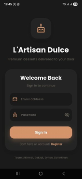
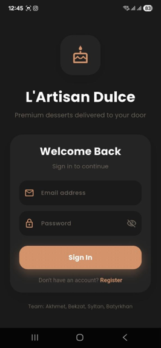
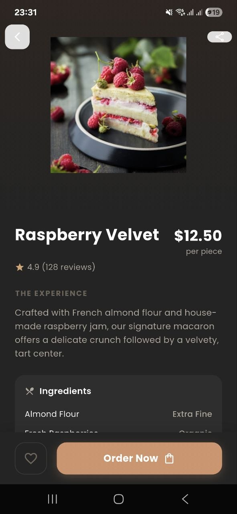
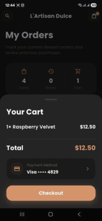

# 🥐 L'Artisan Dulce

> A premium pastry shop mobile app built with Flutter — elegant UI, smooth animations, and a unique Mood Filter experience.


---

## 📱 Screenshots


| Login | Home | Catalogue |
|-------|------|-----------|
|  |  |  |

| Product Detail | Cart & Checkout | Order Tracking |
|----------------|-----------------|----------------|
|  |  |  |

| Profile | Mood Filter | Profile Settings |
|---------|-------------|-----------------|
|  |  |  |

---

## ✨ Features

- **🍰 Product Catalogue** — Browse desserts by category (Macarons, Croissants, Cakes, etc.) with full-text search across names, categories, and ingredients
- **🌙 Mood Filter** — Tell the app how you're feeling and get personalized dessert recommendations (Comfort → creamy cakes, Celebration → macarons, Energy → fruit desserts, Indulgence → premium chocolate)
- **🛒 Cart & Favourites** — Real-time cart totals, persistent favourites across app restarts
- **📦 Order Tracking** — Live order status flow: Created → Preparing → On the Way → Delivered
- **👤 Auth & Profile** — Email login, guest browsing, profile editing with avatar upload (camera or gallery)
- **⭐ Product Ratings** — 1–5 star rating dialog with live emoji reactions
- **🌑 Premium Dark Theme** — Charcoal background (`#1A1A2E`) with warm peach accent (`#D4936C`) optimized for product photography

---

## 🎬 Animations

- **Hero Transitions** — Tapping a product card smoothly expands into the detail screen using Flutter's `Hero` widget with a unique tag per product
- **TactileWrapper** — Custom wrapper that fires `HapticFeedback.lightImpact()` on tap with a subtle scale-down effect on every interactive element

---

## 🏗️ Architecture

The app uses a **Clean Lightweight Architecture** — four clear layers, no heavy boilerplate:

```
Flutter UI Screens
      │
      ▼  reads state / calls methods
AppStateProvider (InheritedNotifier)
AppState (ChangeNotifier)
      │                    │
      ▼                    ▼
ProductRepository     shared_preferences
(5-min cache)         (favourites, profile, auth)
      │
      ▼
ApiService (Mock — TheMealDB format)
```

| Layer | Responsibility |
|-------|----------------|
| **Presentation** | Screens and widgets |
| **State** | `AppStateProvider` — single source of truth |
| **Repository** | Data logic, 5-minute in-memory cache |
| **Persistence** | `shared_preferences` for favourites, auth, profile |

### Why not BLoC or Redux?

| Pattern | Why we skipped it |
|---------|-------------------|
| BLoC / Cubit | Too much boilerplate for a 4-person portfolio project |
| Redux | Even more boilerplate — actions/reducers everywhere |
| **ChangeNotifier** ✅ | Simple, native Flutter, zero dependencies |

---

## 🎨 Design System

| Role | Value | Usage |
|------|-------|-------|
| Background | `#1A1A2E` dark charcoal | Every screen background |
| Accent | `#D4936C` warm peach | Buttons, highlights, active states |
| Cards / tags | Cream and cocoa tones | Product cards, category chips |
| Primary text | Soft white | Product names, headings |
| Secondary text | Muted beige | Descriptions, metadata |

---

## 🧪 Testing

Unit and widget tests cover the things that actually matter:

- **Cache invalidation** logic in `ProductRepository`
- **Cart total** calculations (empty cart, max quantity edge cases)
- **Mood-to-product** mapping correctness
- **TactileWrapper** tap callbacks
- **Rating dialog** emoji updates
- **Cart quantity** controls

### Edge Cases Handled

| Situation | Behaviour |
|-----------|-----------|
| Empty cart at checkout | Checkout button disabled, empty state shown |
| API timeout | Returns cached data if available + retry option |
| Rating same product twice | Dialog pre-fills existing rating, updates instead of duplicating |
| Avatar fails to load | Falls back to initials-based placeholder |
| Search returns nothing | Empty state with suggested category links |

---

## 🚀 Getting Started

### Prerequisites

- [Flutter SDK](https://docs.flutter.dev/get-started/install) 3.x
- Dart 3.x
- Android Studio / Xcode

### Installation

```bash
# Clone the repository
git clone https://github.com/your-username/lartisan-dulce.git
cd lartisan-dulce

# Install dependencies
flutter pub get

# Run on connected device or emulator
flutter run
```

### Build

```bash
# Android APK
flutter build apk --release

# iOS
flutter build ios --release
```

---

## 📦 Dependencies

| Package | Purpose |
|---------|---------|
| `shared_preferences` | Local persistence for favourites, auth, profile |
| _(no external state packages)_ | State managed with Flutter's built-in `ChangeNotifier` |

---

## 🗺️ Roadmap

The architecture is already set up for a real backend — `ApiService` is the only layer that needs to change.

| Integration | Technology | What it enables |
|-------------|-----------|-----------------|
| Database | Firebase Firestore | Live product updates, real inventory |
| Auth | Firebase Auth / Supabase | Secure login, social sign-in |
| Payments | Stripe Flutter SDK | In-app checkout |
| Push notifications | Firebase Cloud Messaging | Order status alerts |
| Analytics | Firebase Analytics | Track which moods convert best |

**Future ideas:** loyalty programme, user photo reviews, admin dashboard for bakery staff, AR dessert preview.
---

## 📄 License

This project was created as a final project for the **Cross Platform Development** course at **Astana IT University**, Department of Software Engineering (SE-2416, 2026).

---

<p align="center">Made with ☕ and Flutter by Akhmet · Bekzat</p>
